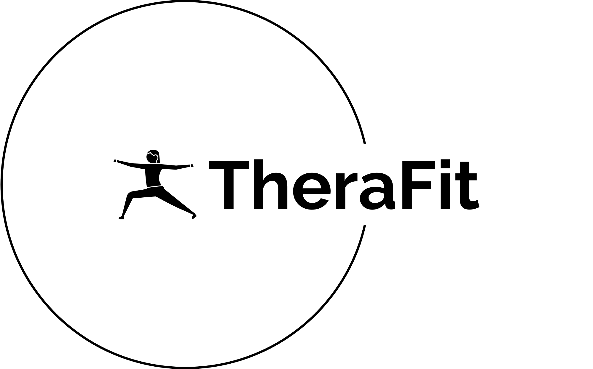
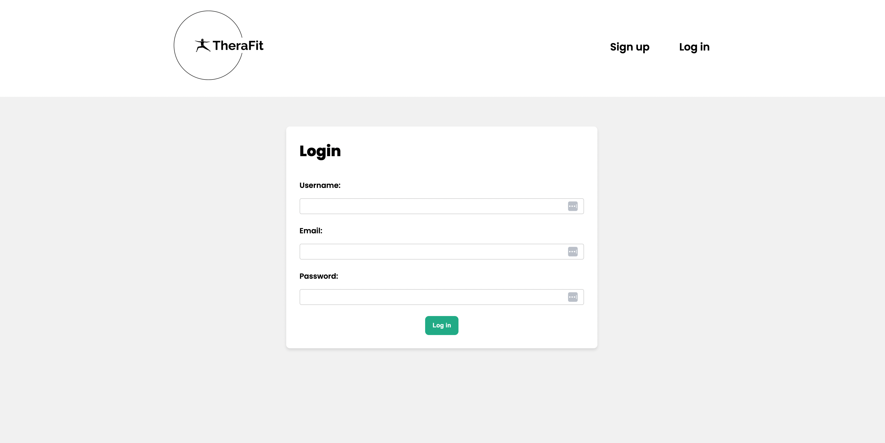
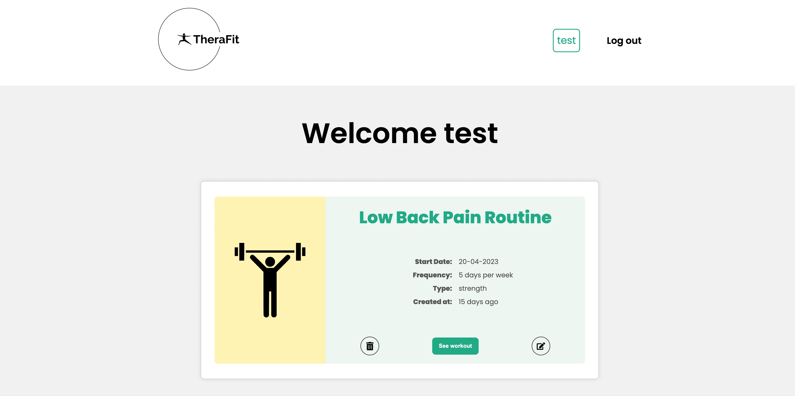
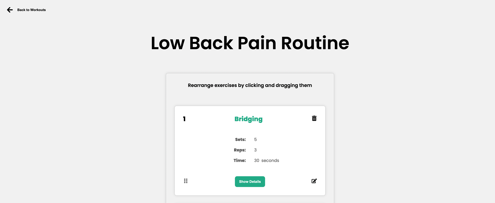
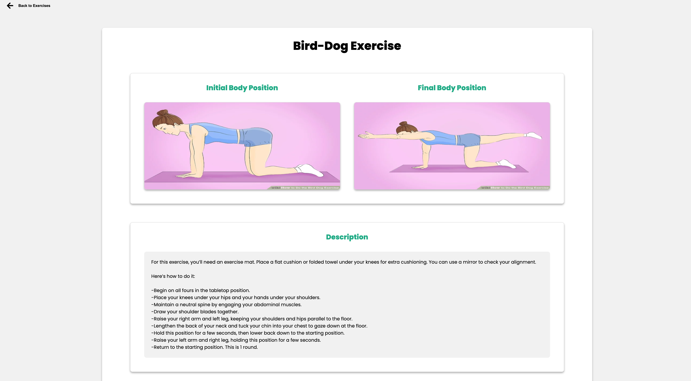
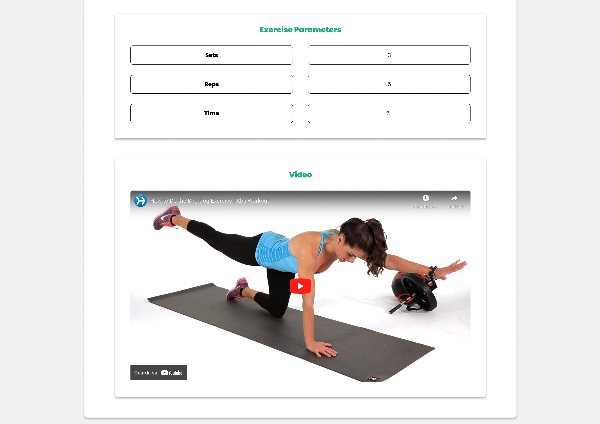

 
<a name="readme-top"></a>

<!-- PROJECT LOGO -->

<br />
<div align="center">

 # TheraFit - Workout Planner App

 
  
 <h3 align="center">Plan. Customize. Progress.</h3>

 <p align="center">
    Revolutionize therapy and fitness with TheraFit: Collaboratively create workouts, exercises, and modifications tailored to individual needs for therapists, patients, personal trainers, and clients, ensuring progress and satisfaction for everyone involved.
 </p>
</div>


## Table of contents

- [Overview](#overview)
  - [Project Details](#project-details)
  - [Demo](#demo)
  - [Screenshot](#screenshot)
  - [Links](#links)
- [Process](#process)
  - [Technologies](#technologies)
  - [Why TheraFit](#why-therafit)
  - [What I learned](#what-i-learned)
  - [Optimizations](#optimizations)
- [Getting started](#getting-started)
- [License](#license)

## Overview

### Project Details

TheraFit is a comprehensive workout management app designed to help patients and therapists, or trainers and clients, collaboratively create, modify, and track exercises. With a user-friendly interface and compatibility across multiple devices, TheraFit streamlines the process of building personalized workout routines for everyone.


 Features: 
- Authentication system with Sign up and Log in
- Create, modify, delete, and view workouts
- Customize workouts with title, start and end dates, frequency and type
- Add, update, delete, and view unlimited exercises to a workout
- Drag and drop exercises to arrange the sequence
- Customize exercises with title, sets, reps, load, time, description, images or videos
- Choose to upload images or paste links from the web
- View all the exercise details with a click of a button

<p align="right">(<a href="#readme-top">back to top</a>)</p>

### Demo


<p align="right">(<a href="#readme-top">back to top</a>)</p>

### Screenshot

<details>
  <summary>Show Images</summary>
    <div align="center">
      
      
      
      
      
      </div>
</details>

<p align="right">(<a href="#readme-top">back to top</a>)</p>

 +++ take it from profile readme +++

### Links

- [Code Source](https://github.com/Alkxs/TheraFit/tree/main)
- [Live Site](https://therafit.netlify.app/)

<p align="right">(<a href="#readme-top">back to top</a>)</p>

## Process

### Technologies

Client Side:

- HTML
- CSS
- JavaScript
- React
- Vite
- React Libraries:
  - date-fns
  - react-dnd
  - react-icons
  - react-player
  - react-router-dom
  - react-select

Server Side:

- Node js
- Express
- MongoDB
- Cloudinary
- JWT (authentication, signup and login)
- dotenv
- bcrypt
- CORS
- Mongoose
- Morgan
- Multer
- Nodemon
- Validator

<p align="right">(<a href="#readme-top">back to top</a>)</p>


 ### Why TheraFit:

TheraFit was developed to address real-world challenges that I observed during my career in healthcare. I noticed that patients often struggled to remember the exercises prescribed to them, and therapists needed a more efficient way to assign and keep track of patients' progress.

With these issues in mind, TheraFit was designed to serve as a quick reference for patients to effectively carry out their workouts, while also providing therapists with a platform to prescribe exercises directly. By moving away from paper-based methods and embracing digital technology, TheraFit helps improve the accuracy of workout tracking and makes it easier to measure progress over time.

Moreover, TheraFit is easily adaptable for the general population, making it an excellent tool for personal trainers and clients or sports-specific coaching. This flexibility demonstrates the project's potential to positively impact a wide range of users.

By creating TheraFit, I aimed to demonstrate my ability to build a practical solution that addresses real-world problems in healthcare and showcases my technical skills as a developer. This project serves as an example of my commitment to innovation, user experience, and my passion for making a difference in people's lives through technology.

<p align="right">(<a href="#readme-top">back to top</a>)</p>
 

### What I learned


Developing TheraFit has provided me with valuable experience and a deeper understanding of various technical skills and concepts. Here are some key takeaways from this project:

React: I gained hands-on experience in building a scalable and maintainable application using React, including functional components, hooks, and state management.

- React Router: I learned how to implement navigation within the application using React Router for seamless user experience while navigating between different views and components.

- Managing Complex State in React: I learned to manage complex application state using React's Context API and the useReducer hook, allowing for efficient state management across multiple components.

- Complex Problem Solving: I developed my problem-solving skills by tackling challenging tasks and implementing features from scratch, such as drag & drop functionality.

- CRUD Operations: TheraFit required implementing create, read, update, and delete (CRUD) operations to manage workouts and exercises, deepening my understanding of handling data effectively in a web application.

- Client-Server Communication: I learned how to send requests from the client-side to the server-side, enabling seamless data exchange between the front-end and back-end.

- Node.js & Express: I gained experience in setting up a server using Node.js and Express, as well as building RESTful APIs for handling client requests and performing CRUD operations with the database.

- MVC Architecture: I learned how to set up and utilize the Model-View-Controller (MVC) architecture, allowing for a clean and maintainable codebase.

- MongoDB & Mongoose: I learned how to work with MongoDB as the database solution and Mongoose as an Object Data Modeling (ODM) library, enabling me to define schemas, models, and perform database operations.

- Authentication: I implemented JWT for user authentication, signup, and login, ensuring secure access and protection of user data.

- External Dependencies: I utilized various external libraries and dependencies to efficiently integrate additional features and functionality into the application.

- Cloudinary: I learned how to use Cloudinary for image and video storage, enabling users to upload and manage media files within the application.

- Image Upload Feature: I implemented an image upload feature, allowing users to upload images for initial and final body positions, as well as reference images or videos from external sources.

Through the development of TheraFit, I acquired a deeper understanding of various technical skills and concepts, which I can apply to future projects. This experience has contributed significantly to my growth as a developer and has prepared me to tackle new challenges in the ever-evolving world of web development.


<p align="right">(<a href="#readme-top">back to top</a>)</p>


### Optimizations

To further improve TheraFit, there are several areas in which the application could be optimized. These improvements are divided into three main categories: design, functionality, and efficiency/code improvement.

#### Design

- Responsive Design: Ensure that the application's design is even more fully responsive and optimized for a wide range of devices, including mobile phones, tablets, and desktops. This would improve accessibility and user experience across different platforms.

- Improved User Interface: Streamline the user interface to make it more visually appealing and easier to navigate. This could include reorganizing menus, refining typography, and enhancing visual elements such as icons and images.

- Accessibility: Implement accessibility best practices, including proper use of semantic HTML, ARIA attributes, and keyboard navigation, to make the application more inclusive and user-friendly for all users, including those with disabilities.

#### Functionality

- Exercise Library: Develop a built-in library of common exercises, with images and descriptions, to simplify the process of creating workouts and make it more efficient for both therapists and patients.

- Progress Tracking & Analytics: Implement a progress tracking system that allows users to log their workout data and visualize their progress over time. This could include graphs, charts, and other visualizations to help users better understand their improvement and stay motivated.

- Integration with Wearable Devices: Integrate the application with popular wearable devices, such as fitness trackers and smartwatches, to automatically track and sync workout data, enhancing the user experience and simplifying the process of monitoring progress.

#### Efficiency/Code Improvement

- Code Refactoring: Review and refactor the existing codebase to ensure best practices are followed, remove redundant code, and improve overall code maintainability and readability.

- Performance Optimization: Optimize the application's performance by implementing techniques such as lazy loading, caching, and minimizing API calls. This would result in faster load times and a smoother user experience.

- Testing & Debugging: Implement a comprehensive suite of automated tests to ensure the application is robust and free of bugs. This includes unit tests, integration tests, and end-to-end tests to cover all aspects of the application.

By focusing on these optimizations, TheraFit can be further improved in terms of design, functionality, and efficiency, resulting in a more polished and user-friendly application that better serves the needs of therapists, patients, and other users.


<p align="right">(<a href="#readme-top">back to top</a>)</p>


### Getting started

Before you set up TheraFit on your local machine, ensure you have the following prerequisites:

Node.js (version 14 or higher)
npm (version 6 or higher) or yarn (version 1 or higher)
MongoDB (version 4.4 or higher)

Once you have the prerequisites, follow these steps:

1. Fork the repository: Click the "Fork" button at the top-right corner of the TheraFit GitHub repository page to create a personal copy of the repository under your GitHub account.

2. Clone the repository: Clone the TheraFit repository using the following command:

```
git clone https://github.com/your_username/TheraFit.git

```

3. Install dependencies for the client: Navigate to the client directory and run npm install or yarn install to install the required dependencies:

```
cd TheraFit/client
npm install

```

or

```
cd TheraFit/client
yarn install)
```

4. Install dependencies for the server: Navigate to the server directory and run npm install or yarn install to install the required dependencies:


```
cd ../server
npm install
```

or

```
cd ../server
yarn install
```

5. Set up environment variables: In the server directory, create a .env file and add the following variables:

```
PORT=<your_desired_port>
DB_STRING=<your_mongodb_connection_string>
SECRET=<your_jwt_secret>
CLOUDINARY_CLOUD_NAME=<your_cloudinary_cloud_name>
CLOUDINARY_API_KEY=<your_cloudinary_api_key>
CLOUDINARY_API_SECRET=<your_cloudinary_api_secret>
```

Replace the placeholders with your own values.


6. Run the application: In the server directory, run the following command to start both the client and server concurrently in development mode:

```
npm run dev

```

The client should now be running on http://localhost:5173 and the server on http://localhost:<your_desired_port>. You can now start using TheraFit and make any desired changes to the codebase.

Remember to always keep your environment variables and sensitive information secure, especially when deploying your application or sharing your code publicly.

<p align="right">(<a href="#readme-top">back to top</a>)</p>

### License

TheraFit is licensed under the MIT License. See the [LICENSE](LICENSE) file for details.
